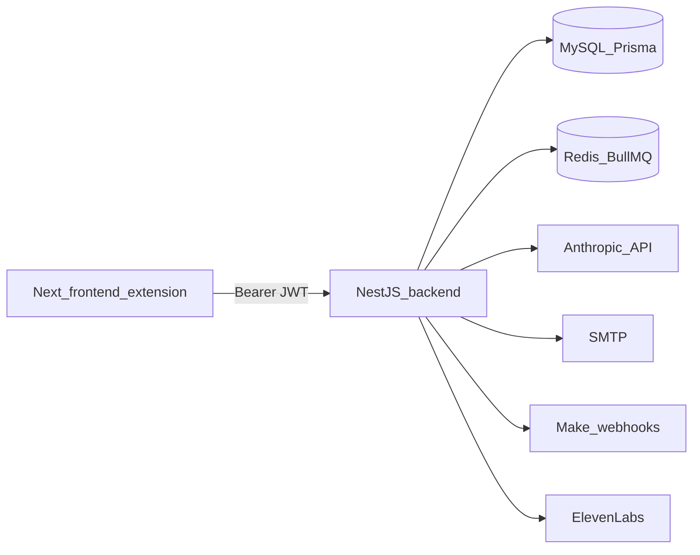

# Revisión de seguridad backend

Fecha: 2026-07-18

## Resumen ejecutivo

El backend NestJS tiene una base razonable: JWT Bearer, `ValidationPipe` global, Helmet, CORS con allowlist, Throttler global, validación de ficheros con magic bytes, tokens mágicos con hash y controles SSRF parciales en importación de adjuntos.

Los riesgos principales antes de remediar son: registro público abierto, autenticación fail-open para nuevos controllers, JWT sin revocación ni `issuer`/`audience`, un upload Yubiq sin límite Multer explícito, ausencia de filtro global de errores, rate limits insuficientes para IA/uploads, DTOs débiles en KYC y comparaciones de secretos de webhooks no timing-safe.

## Alcance

Revisado:

- Módulos y controllers NestJS en `backend/src/`.
- Bootstrap, CORS, Helmet, ValidationPipe, throttling y healthchecks.
- Autenticación JWT, magic links, invitaciones y guards.
- Autorización endpoint por endpoint, incluyendo ownership y modelo compartido KYC.
- Uploads, descargas públicas por token y validación de ficheros.
- Endpoints IA y llamadas a Anthropic / ElevenLabs / Make / SMTP.
- Prisma, raw SQL, paginación y operaciones costosas.
- Variables de entorno y comprobaciones de producción existentes.

No revisado todavía con ejecución:

- `npm audit` / `npm outdated`.
- Suite completa de tests, lint y build.
- Configuración real de Coolify/Traefik fuera del repositorio.
- Historial Git completo de secretos.

## Arquitectura revisada

Inventario completo: `docs/BACKEND_ENDPOINT_INVENTORY.md`.

## Hallazgos

| ID | Severidad | Hallazgo | Componente | Impacto | Recomendación | Estado |
| --- | --- | --- | --- | --- | --- | --- |
| B-01 | High | Registro público abierto y enumeración de email | `backend/src/auth/auth.controller.ts`, `backend/src/auth/auth.service.ts` | Creación no autorizada de usuarios y descubrimiento de cuentas | Deshabilitar registro público; mantener alta por invitación | MITIGATED |
| B-02 | High | Sesiones sin revocación servidor; access token default 5 días | `backend/src/auth/auth.module.ts` | Robo de JWT válido hasta expiración | Reducir TTL, endurecer claims; planificar revocación/rotación de secretos | IN PROGRESS |
| B-03 | High | Upload Yubiq sin `limits.fileSize` en Multer | `backend/src/yubiq/approve-seal-filler/approve-seal-filler.controller.ts` | DoS por memoria antes de validar magic bytes | Añadir límite Multer explícito y DTO para `model` | MITIGATED |
| B-04 | High | Auth fail-open: JWT guard no es global | `backend/src/app.module.ts` | Un controller nuevo sin guard queda público | Introducir `APP_GUARD` JWT global y decorador `@Public` | MITIGATED |
| B-05 | Medium | Fallbacks de secretos en JWT, magic e invitaciones | `backend/src/auth/*`, `backend/src/invitations/*` | Riesgo de arranque inseguro fuera de producción | Eliminar fallbacks runtime o validarlos con fail-fast | MITIGATED |
| B-06 | Medium | JWT sin `algorithms`, `issuer` ni `audience` explícitos | `backend/src/auth/auth.module.ts`, `backend/src/auth/strategies/jwt.strategy.ts` | Tokens aceptados con validación incompleta de contexto | Fijar algoritmo HS256 y validar `iss`/`aud` configurables | MITIGATED |
| B-07 | Medium | Sin filtro global de excepciones | `backend/src/main.ts` | Posible exposición de errores técnicos / proveedores | Añadir filter global con `requestId` y sanitización | MITIGATED |
| B-08 | Medium | Rate limiting insuficiente para IA/uploads/exportaciones | `backend/src/app.module.ts`, controllers IA/upload | Abuso de coste y recursos | Añadir throttles por categoría crítica | MITIGATED |
| B-09 | Medium | KYC usa cuerpos inline / `Record<string, unknown>` sin DTOs estrictos | `backend/src/kyc/kyc.controller.ts` | Validación incompleta, payloads excesivos, mass assignment mitigado solo en service | Crear DTOs mínimos y límites de tamaño | IN PROGRESS |
| B-10 | Medium | Webhooks Make/RFQ/expense comparan secreto con `!==` | Servicios de Make, RFQ, expenses | Timing side-channel y patrón inconsistente | Helper timing-safe para secretos | MITIGATED |
| B-11 | Medium | Tokens públicos de adjuntos pueden quedar sin expiración | `backend/src/attachments/attachments.service.ts` | Acceso por token más largo de lo esperado si falla callback | Establecer expiración siempre al publicar | MITIGATED |
| B-12 | Medium | `MAIL_SKIP_SEND` registra URL mágica completa | `backend/src/mail/mail.service.ts`, `backend/src/main.ts` | Exposición de token en logs | Prohibir en producción y redactar tokens en logs | MITIGATED |
| B-13 | Medium | Listados sin paginación | `activations`, `expenses` | Abuso de recursos y respuestas grandes | Añadir paginación compatible con límites máximos | MITIGATED |
| B-14 | Medium | SSRF residual por DNS rebinding | `backend/src/attachments/attachments.service.ts` | Cambio de IP entre validación y conexión | Documentar residual y reforzar donde sea práctico | ACCEPTED |
| B-15 | Medium | `ValidationPipe` no fija `forbidUnknownValues` ni desactiva conversión implícita | `backend/src/main.ts` | Validación menos estricta de objetos extraños | Ajustar pipe global tras comprobar compatibilidad | MITIGATED |
| B-16 | Medium | Magic link no se consume de forma atómica | `backend/src/auth/auth.service.ts` | Posible doble uso concurrente | Usar update condicionado a `usedAt: null` | MITIGATED |
| B-17 | Medium | `trust proxy` no configurado/documentado | `backend/src/main.ts` | Rate limit por IP impreciso detrás de Traefik | Configurar solo para proxy conocido y documentar Coolify/Traefik | MITIGATED |
| B-18 | Low | Dos controllers `GET /health` | `backend/src/health.controller.ts`, `backend/src/health/health.controller.ts` | Healthcheck ambiguo | Separar `/health/live` y `/health/ready` | MITIGATED |
| B-19 | Low | `$queryRawUnsafe` estático en processor | `backend/src/queue/activation-send.processor.ts` | Bajo al no usar input de usuario | Sustituir por consulta segura o documentar | ACCEPTED |
| B-20 | Informational | Swagger ausente | Backend | Sin superficie Swagger pública | Mantener deshabilitado o proteger si se añade | NOT APPLICABLE |
| B-21 | Informational | CSRF clásico no aplica al usar Bearer, no cookies de sesión | Auth | Riesgo mitigado por no usar cookies auth | Mantener CORS estricto y no mezclar cookies sin CSRF | NOT APPLICABLE |
| B-22 | Informational | KYC compartido entre usuarios autenticados por diseño | `docs/KYC.md`, `backend/src/kyc` | Riesgo de confidencialidad aceptado si el catálogo es corporativo compartido | Documentar decisión; reabrir si cambia el modelo | ACCEPTED |
| B-23 | Informational | Validación de ficheros con magic bytes ya existe | `backend/src/files/safe-file-validation.ts` | Reduce riesgo de MIME/extensión falsa | Mantener allowlists y ampliar antivirus en infraestructura | MITIGATED |

## Evidencias técnicas

### Autenticación y JWT

- `JwtAuthGuard` es opt-in por controller; el único `APP_GUARD` actual es `ThrottlerGuard`.
- `JwtModule` firma con `JWT_SECRET` o fallback y `JWT_EXPIRES_IN` por defecto `5d`.
- `JwtStrategy` extrae solo Bearer y valida expiración, pero no fija `algorithms`, `issuer` ni `audience`.
- No existen refresh tokens ni endpoint de logout servidor.

### Magic links e invitaciones

- Los tokens se generan con `randomBytes(32)` y se almacenan hasheados con SHA-256 y secreto servidor.
- La petición de magic link usa respuesta genérica anti-enumeración.
- El consumo de magic link hace lectura y actualización separadas; debe hacerse atómico.

### Autorización

- Áreas administrativas usan `AdminGuard`.
- Activations, RFQ, MEDDPICC y expenses aplican ownership por `userId` en servicios.
- KYC está documentado como catálogo compartido entre usuarios autenticados; se deja aceptado por negocio.

### Uploads

- `safe-file-validation.ts` detecta PDF, Office/ZIP, imágenes y ejecutables por firma.
- Yubiq valida después de recibir el buffer, pero `FileInterceptor('file')` no define límite Multer.
- Descargas autenticadas aplican `Content-Disposition` y `X-Content-Type-Options` en varios endpoints.

### SSRF

- `AttachmentsService.downloadFromUrl` bloquea localhost, metadata, redes privadas y redirecciones peligrosas.
- Riesgo residual: DNS rebinding entre `lookup` y `fetch`.

### Logging y errores

- No hay `ExceptionFilter` global.
- `MAIL_SKIP_SEND=true` puede registrar enlaces mágicos completos.
- No hay redactor central de campos sensibles.

## Recomendación de implementación

Aplicar correcciones por bloques:

1. Bloque A: cerrar registro público, auth fail-closed, límite Yubiq, webhooks timing-safe, magic link atómico, JWT claims.
2. Bloque B: filtro de errores, requestId, logging/redacción, throttles específicos, DTOs KYC/Yubiq, baseline.
3. Bloque C: paginación, health live/ready, timeouts, dependencias y tests de seguridad.

## Secretos a revisar o rotar manualmente

No se listan valores de secretos.

- `JWT_SECRET`: rotar tras incidente o si hubo exposición de tokens.
- `MAGIC_LINK_SECRET`: rotar si se reutiliza `JWT_SECRET` o hay sospecha de logs.
- `INVITE_TOKEN_SECRET`: configurar fuerte y separado.
- `ANTHROPIC_API_KEY_MASTER_KEY`: rotar si hubo exposición del backend o DB.
- `SMTP_PASS`, `MAKE_WEBHOOK_SECRET`, `MAKE_CALLBACK_SECRET`, `RFQ_EMAIL_WEBHOOK_SECRET`, `EXPENSE_EMAIL_WEBHOOK_SECRET`, `ELEVENLABS_WEBHOOK_SECRET`, `ELEVENLABS_API_KEY`: rotar según política post-incidente.

## Cambios aplicados

- `POST /auth/register` responde `410 Gone`; el alta queda por invitación.
- `JwtAuthGuard` queda como `APP_GUARD`; los endpoints públicos usan `@Public()`.
- JWT firma y verifica con `HS256`, `issuer` y `audience`.
- Se eliminan fallbacks literales de JWT/magic/invitaciones.
- Magic links se consumen con `updateMany` condicionado a `usedAt: null` y `expiresAt`.
- Yubiq aplica límite Multer de 20 MB y DTO para `model`.
- Webhooks Make/RFQ/expenses usan comparación timing-safe.
- `ValidationPipe` activa `forbidUnknownValues` y desactiva conversión implícita.
- Se añade `requestId`, filtro global de excepciones y logging HTTP sin cuerpos.
- Se añade redacción central de campos sensibles.
- `MAIL_SKIP_SEND=true` queda bloqueado en producción y el log local omite la URL mágica.
- Tokens públicos de adjuntos expiran siempre.
- Se añaden throttles específicos para IA, uploads, exportaciones e importaciones masivas.
- KYC incorpora DTOs para creación/importación/borrado/chat.
- `activations` y `expenses` tienen paginación máxima de 100 items.
- Healthchecks separados: `/health/live` y `/health/ready`; `/health` queda como compatibilidad live.
- Timeouts explícitos añadidos a Anthropic, ElevenLabs y Google News RSS.
- `docs/BACKEND_SECURITY_BASELINE.md` creado.

## Dependencias

Se ejecutó `npm audit fix` sin `--force`. Se actualizó `backend/package-lock.json` con parches compatibles.

Actualización adicional aplicada el 2026-07-19:

- NestJS runtime actualizado a v11 (`@nestjs/common`, `core`, `platform-express`, `config`, `jwt`, `passport`) para mitigar la cadena `@nestjs/core` / `platform-express` / `multer` / `qs` / `file-type` / `lodash`.
- `main.ts` fija `query parser = extended` y métodos/headers CORS explícitos para compatibilidad con Express 5.
- Runtime Node validado: backend/frontend declaran `node >=20 <23`, ejecutan comprobación `preinstall`, y Docker usa `node:22-alpine`.
- `nodemailer` actualizado a v9. La validación TLS estricta queda activa; no se añade `tls.rejectUnauthorized=false`.
- `bcrypt` actualizado a v6 para retirar la cadena vulnerable `node-pre-gyp` / `tar`. Los hashes existentes siguen siendo compatibles.
- `xlsx` sustituido por `@stackline/xlsx` y el parsing Excel se ejecuta en proceso hijo con timeout y límite de memoria.

Residual:

- Sin vulnerabilidades conocidas reportadas por `npm audit`. El procesamiento de Excel mantiene riesgo residual operativo por tratar ficheros no confiables, mitigado mediante aislamiento del proceso parser.

## Estado de pruebas

- Lints IDE: sin errores.
- `npm test`: 6 archivos, 30 tests, todos pasan.
- `npm run build`: OK.
- `npm audit`: 0 vulnerabilidades.
- Smoke de extracción Excel aislada: OK.
- `npm outdated`: quedan actualizaciones no aplicadas en Prisma, BullMQ, Helmet, tipos y majors de tooling; no están reportadas por `npm audit`.
