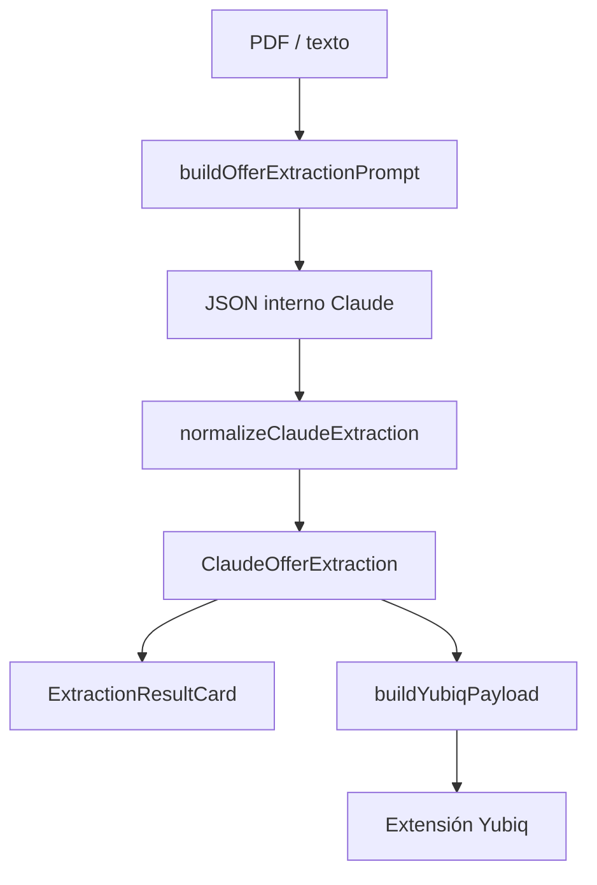

# Registro central de reglas: oferta comercial y Yubiq

Este documento **resume** las reglas de negocio y el comportamiento técnico del flujo de análisis de ofertas (extracción con Claude), normalización en backend, construcción del payload para la extensión Yubiq y visualización en la app. La **fuente literal** enviada al modelo sigue siendo el código del prompt; aquí no se duplica el texto completo del prompt.

**Índice:** [Alcance](#alcance-y-propósito) · [Extracción (prompt)](#extracción-prompt) · [Normalización (backend)](#normalización-backend) · [Revenue / payload Yubiq](#revenue--payload-yubiq) · [Visualización (frontend)](#visualización-frontend) · [Tabla de constantes](#tabla-de-constantes-y-archivos) · [Mantenimiento](#mantenimiento)

---

## Alcance y propósito

- **Qué cubre:** reglas acordadas para interpretar PDFs de oferta, calcular totales cuando aplica compromiso, elegir el importe que se envía a Yubiq (`revenue` / `amount`) y cómo se muestra el resultado al usuario.
- **Qué no sustituye:** el archivo [`backend/src/yubiq/approve-seal-filler/prompts/offer-extraction-prompt.ts`](../backend/src/yubiq/approve-seal-filler/prompts/offer-extraction-prompt.ts) (instrucciones ejecutables a Claude) y los tests ([`frontend/src/lib/yubiq/yubiq-payload.test.ts`](../frontend/src/lib/yubiq/yubiq-payload.test.ts)).
- **Objetivo:** un solo lugar legible para revisar cambios y enlazar PRs/issues sin perder el hilo entre prompt, constantes, normalizador y UI.

---

## Extracción (prompt)

**Archivo:** [`backend/src/yubiq/approve-seal-filler/prompts/offer-extraction-prompt.ts`](../backend/src/yubiq/approve-seal-filler/prompts/offer-extraction-prompt.ts)

Resumen de intención (detalle en el propio prompt):

| Tema | Regla |
|------|--------|
| **Importes netos** | Usar valores **tras descuento** (precio final, total a pagar, neto) cuando el documento distinga lista vs rebajado. |
| **Proyecto vs recurrente** | **Proyecto / implementación:** cargo **único** (no se multiplica por tiempo). **Servicios / mensualidad:** cuota **mensual** aplicable durante el periodo de compromiso. |
| **Compromiso temporal** | Si el documento habla en **años** (habitualmente 1–5), convertir a **meses** (12, 24, 36, 48, 60). Si ya está en meses, usar ese número. |
| **Rangos y opciones** | Si hay varias opciones o rango min–max, tomar el escenario de **mayor importe neto** para totales y campos numéricos. |
| **JSON devuelto** | Incluye campos como `importeOferta`, `importeProyectoEuros`, `importeMensualEuros`, `importeSuscripcionOlicenciaAnualEuros`, `periodoCompromisoMeses`, `periodoCompromisoTexto`, `multiplesOpcionesPrecio`, `numeroOpcionesPrecioEstimado`, `soloImporteTarifaTmSinJornadas`, `confidence`, etc. (estructura exacta en el prompt). |
| **Licencia/suscripción anual** | Línea anual de producto (no AMS ni accesorios). Se suma **una vez** con el proyecto cuando no hay total de compromiso mensual. |

---

## Normalización (backend)

**Archivos principales:**

- [`backend/src/yubiq/approve-seal-filler/offer-extraction-normalizer.ts`](../backend/src/yubiq/approve-seal-filler/offer-extraction-normalizer.ts)
- [`backend/src/yubiq/approve-seal-filler/offer-extraction.types.ts`](../backend/src/yubiq/approve-seal-filler/offer-extraction.types.ts)

**Comportamiento:**

1. **Área compañía** — Normalización a `RUN` \| `GROW` \| `SAIBORG` \| `WISE` \| `YUBIQ`; recuperación desde observaciones si hace falta (warnings en log de análisis).

2. **Total periodo de compromiso** — Si constan datos suficientes (`importeProyectoEuros`, `importeMensualEuros`, `periodoCompromisoMeses` parseados):
   - Fórmula: **proyecto (una vez) + mensual × meses** (si solo hay mensual sin proyecto, **mensual × meses**).
   - Salida: `importeTotalConCompromisoNumerico`, `importeTotalConCompromisoTexto`, `notaImporteCompromiso` (texto explicativo).
   - Warning si el modelo envió meses de compromiso pero no son interpretables.

3. **Total deal computable (proyecto + licencia/suscripción anual)** — Si **no** se calculó el total de compromiso del punto anterior y constan `importeProyectoEuros` y `importeSuscripcionOlicenciaAnualEuros` (ambos > 0 tras parsear):
   - Fórmula: **proyecto + suscripción/licencia anual** (cada línea una vez; no multiplica años ni incluye AMS u otros no computables).
   - Salida: `importeTotalDealComputablesNumerico`, `importeTotalDealComputablesTexto`, `notaImporteTotalDealComputables`.

4. **T&M sin jornadas** — Si `soloImporteTarifaTmSinJornadas === true`:
   - Nota fija: ver constante `NOTA_INTERPRETACION_IMPORTE_TM_SIN_JORNADAS`.
   - `importeRevenueTmSinJornadasNumerico` = `IMPORTE_MINIMO_BOLSA_HORAS_TM_EUROS` (10.000 €) para coherencia con el payload Yubiq.

5. **Múltiples opciones de precio** — Si `multiplesOpcionesPrecio` o `numeroOpcionesPrecioEstimado ≥ 2`:
   - Nota generada con `buildNotaMultiplesOpcionesPrecio` (texto base + recuento opcional).
   - Warning `multiples_opciones_precio` en el flujo de análisis.

---

## Revenue / payload Yubiq

**Archivo:** [`frontend/src/lib/yubiq/build-yubiq-payload.ts`](../frontend/src/lib/yubiq/build-yubiq-payload.ts)

**Orden de prioridad** para `document.amount` y `prefill.revenue` (mismo valor numérico en euros, sin decimales en la cadena):

1. **`importeTotalConCompromisoNumerico`** si es un número finito **> 0** → warning `revenue_from_importe_total_compromiso`.
2. Si no aplica (1), **`importeTotalDealComputablesNumerico`** si es finito **> 0** → warning `revenue_from_importe_total_deal_computables`.
3. Si no aplica (1) ni (2), **`importeRevenueTmSinJornadasNumerico`** si es finito **> 0** → warning `revenue_from_tm_sin_jornadas_min`.
4. Si no aplica (1–3), **`parseAmountAndCurrency(importeOferta)`** (puede emitir `revenue_unparsed`, `currency_not_detected`, etc.).

El resto del payload (título prefill, segmento, `companionMeta`, etc.) sigue la lógica del mismo archivo y [`frontend/src/types/yubiq-payload.ts`](../frontend/src/types/yubiq-payload.ts).

---

## Visualización (frontend)

**Archivo principal:** [`frontend/src/components/yubiq/ExtractionResultCard/ExtractionResultCard.tsx`](../frontend/src/components/yubiq/ExtractionResultCard/ExtractionResultCard.tsx)

| Elemento | Comportamiento |
|----------|----------------|
| **Importe** | Muestra `importeOferta` y, si aplica, bloque “Múltiples importes” (details) con aviso compacto, icono de advertencia y texto desplegable. |
| **Total importe comprometido** | Etiqueta + valor; la nota larga de cálculo (`notaImporteCompromiso`) va en **tooltip** (botón info azul, panel en portal `position: fixed` para no recortar). |
| **Total importe computable** | Si hay proyecto + licencia anual y no hay total de compromiso mensual: muestra `importeTotalDealComputablesTexto` y tooltip con `notaImporteTotalDealComputables`. |
| **T&M** | Nota bajo importe cuando viene `notaInterpretacionImporte`. |
| **JSON** | Bloque colapsable “Visualizar JSON RAW generado por Claude” con subtítulo de depuración y área `<pre>` con scroll. |

**Tipos compartidos (frontend):** [`frontend/src/types/yubiq.ts`](../frontend/src/types/yubiq.ts)

---

## Tabla de constantes y archivos

| Símbolo / concepto | Valor o rol | Archivo |
|--------------------|------------|---------|
| `NOTA_INTERPRETACION_IMPORTE_TM_SIN_JORNADAS` | Texto fijo nota T&M | [`nota-interpretacion-importe.constant.ts`](../backend/src/yubiq/approve-seal-filler/nota-interpretacion-importe.constant.ts) |
| `IMPORTE_MINIMO_BOLSA_HORAS_TM_EUROS` | `10000` — revenue Yubiq en escenario T&M sin jornadas | Idem |
| `NOTA_MULTIPLES_OPCIONES_PRECIO_BASE` | Texto base aviso múltiples opciones | [`nota-multiples-opciones-precio.constant.ts`](../backend/src/yubiq/approve-seal-filler/nota-multiples-opciones-precio.constant.ts) |
| `buildNotaMultiplesOpcionesPrecio` | Añade recuento aproximado de opciones | Idem |

---

## Mantenimiento

1. Cualquier cambio de **regla de negocio** debe reflejarse donde corresponda: **prompt**, **constantes**, **normalizador**, **`buildYubiqPayload`**, **UI** — y **actualizar este documento** en el mismo cambio cuando la regla sea relevante para quien revise el producto.
2. No duplicar listas largas del prompt aquí: actualizar el resumen de tablas/secciones y enlazar al archivo de código.
3. Los tests de payload (`yubiq-payload.test.ts`) validan cifras y prioridades; al cambiar el orden de revenue, ampliar o ajustar tests.

---

## Diagrama de flujo (resumen)

